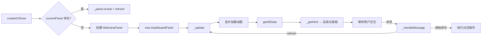

# 仪表板面板 — `dashboardPanel.js`

## 概述

完整的仪表板 WebView 面板，通过 `ghcpDashboard.open` 命令打开。使用 VS Code 的 `WebviewPanel` API。

## 生命周期



## UI 结构

```
┌─────────────────────────────────────────────┐
│ 🔷 GitHub Copilot Insights Dashboard  [刷新] │  ← Header
├─────────────────────────────────────────────┤
│ [Overview] [Chat Sessions] [AI Stats] [Accounts] [Models & MCP] [Info] │  ← Tab Nav
├─────────────────────────────────────────────┤
│                                             │
│  各 Tab 面板内容...                          │  ← Tab Content
│                                             │
├─────────────────────────────────────────────┤
│  🦊 CodeFox — "..."                         │  ← Footer (随机名言)
└─────────────────────────────────────────────┘
```

## Tab 详解

### 1. Overview（Copilot & Chat）
- Copilot Chat 扩展状态（已安装/未安装、版本、活跃度）
- 最近 5 条**当前工作区**的聊天会话（可重新打开）
- AI 用量图表（接受率柱状图 + 统计数据）
- 空状态/无数据引导 UI

### 2. Chat Sessions
- 从 3 个来源聚合的所有会话（Agent + Chat + 空窗口）
- 可按类型过滤（Agent/Ask/Chat/Custom）
- 按工作区筛选
- 搜索标题
- 每条会话可"Open"重新打开

### 3. AI Stats
- 完整统计数据（记录数、时间范围、总字符等）
- 时间段筛选（Today/This Week/Last 7 Days/Last 30 Days/This Month/All）
- 工作区筛选
- 计分板（总 AI 字符、手动字符、接受率等）
- 活动热力图（GitHub-style calendar heatmap）
- AI Rate 柱状图
- AI vs Typed Characters 对比图
- 折叠/展开控制

### 4. Accounts
- 左侧：所有账户列表（GitHub + Microsoft）
- 右侧：选中账户的详情（信任扩展、MCP 信任、Copilot 策略）
- 活跃 Copilot 账户高亮标记

### 5. Models & MCP
- 可用语言模型列表（ID、厂商、家族、Token 限制）
- MCP 服务器配置列表（名称、类型、来源、命令）
- 注册工具列表（MCP 工具和非 MCP 工具）
- 上下文窗口分析

### 6. Info
- 扩展版本、GitHub 链接、许可证等信息

## 关键设计

1. **加载动画**: 每次刷新先显示狐狸转圈 + 随机励志消息（2 秒轮换）
2. **错误页面**: 数据获取失败时显示友好错误页，包含错误详情 + 解决建议 + 重试按钮
3. **空状态引导**: 无账户/无 Copilot 时显示操作引导按钮
4. **客户端渲染**: 所有图表（柱状图、热力图、折线图）由 `getJS()` 中的纯 JS 在浏览器端绘制
5. **折叠面板**: AI Stats 中的各个图表区域支持折叠/展开
