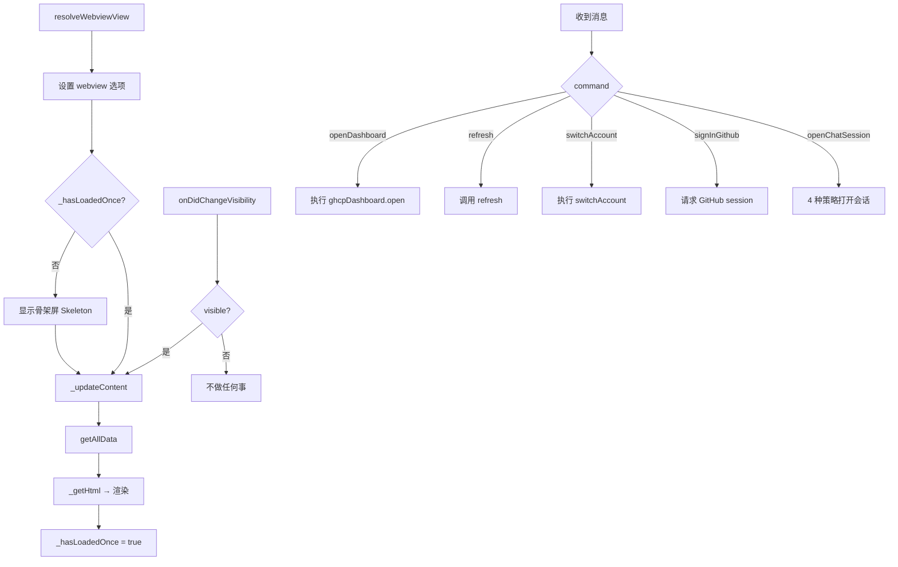

# 侧边栏 — `sidebarProvider.js`

## 概述

注册为 `ghcpDashboard.sidebarView` 的 WebviewView 提供程序，显示在 VS Code 活动栏的 GHCP 图标下。提供紧凑的概览视图。

## 生命周期



## UI 结构

```
┌─────────────────────┐
│ 📊 AI Metrics       │  ← Section
│ [本周概览数据]       │
├─────────────────────┤
│ 💬 Copilot Chat     │  ← Section
│ [状态/版本/账户]     │
├─────────────────────┤
│ 🕐 Recent Sessions  │  ← Section
│ [最近 5 条会话]      │
├─────────────────────┤
│ 🤖 Models           │  ← Section
│ [模型列表]           │
├─────────────────────┤
│ 🔌 MCP Servers      │  ← Section
│ [服务器列表]         │
├─────────────────────┤
│ [Open Dashboard]    │  ← Sticky Footer
│ 🦊 CodeFox          │
└─────────────────────┘
```

## 关键设计

1. **骨架屏**: 首次加载显示灰色骨架动画，给用户即时反馈
2. **Fox 消息轮播**: 加载时底部显示狐狸 + 随机消息，2 秒切换
3. **自动刷新**: 侧边栏从隐藏变为可见时自动刷新数据，避免显示过期缓存
4. **数据精简**: 相比于仪表板面板，侧边栏只显示核心概要，不展示图表
5. **粘性底部**: "Open Full Dashboard" 按钮始终固定在底部
