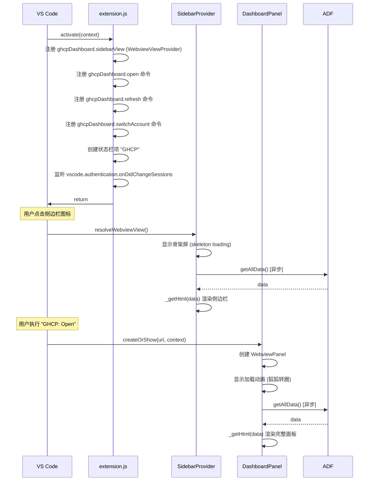

# 入口与激活流程 — `extension.js`

## 概述

扩展的入口点。VS Code 在首次执行任意注册的命令/视图时激活此扩展。

## 激活时序图

## 注册的贡献点

| 贡献类型 | ID | 说明 |
|----------|-----|------|
| 命令 | `ghcpDashboard.open` | 打开完整仪表板面板 |
| 命令 | `ghcpDashboard.refresh` | 刷新所有数据 |
| 命令 | `ghcpDashboard.switchAccount` | 账户切换 QuickPick |
| 视图 | `ghcpDashboard.sidebarView` | 侧边栏 WebView |
| 视图容器 | `ghcp-dashboard` | 活动栏图标 |
| 菜单 | `view/title` | 侧边栏工具栏刷新按钮 |
| 配置 | `l10n: "./l10n"` | 告知 VS Code 翻译包路径 |

## 国际化实现

扩展使用 `vscode.l10n.t()` API 进行本地化：

- **`extension.js`** — 通知消息、QuickPick 项、状态栏文本全部用 `l10n.t()` 包裹
- **`sidebarProvider.js`** — 侧边栏标题、统计标签、按钮、狐狸消息、错误页
- **`dashboardPanel.js`** — 面板标题、Tab 名称、空状态、图表标签、会话列表
- **`trendsPanel.js`** — 趋势面板标题、周期按钮、对比表头

所有翻译字符串收集在 `l10n/bundle.l10n.json`（英文默认）和 `l10n/bundle.l10n.zh-cn.json`（中文）。

## 消息处理

侧边栏和仪表板都通过 `acquireVsCodeApi().postMessage()` 与扩展通信：

| 消息命令 | 处理逻辑 |
|----------|----------|
| `openDashboard` | 执行 `ghcpDashboard.open` |
| `refresh` | 调用 sidebarProvider.refresh() + dashboardPanel.refresh() |
| `switchAccount` | 显示账户操作 QuickPick（登出/登录/管理） |
| `signInGithub` | 静默请求 GitHub session，触发登录 |
| `signInMicrosoft` | 静默请求 Microsoft session |
| `manageAccounts` | 打开 VS Code 账户管理页 |
| `openSettings` | 打开 `editor.aiStats.enabled` 设置 |
| `openChatSession` | 4 种策略尝试重新打开聊天会话 |
| `openMcpConfig` | 用文本编辑器打开 mcp.json |
| `copyAccountInfo` | 复制文本到剪贴板 |

## 关键设计

1. **延迟加载**: 无 `activationEvents`，全靠命令/视图触发
2. **单例面板**: `DashboardPanel.currentPanel` 确保只有一个仪表板实例
3. **自动刷新**: 认证变化时自动刷新侧边栏和仪表板
4. **状态栏**: 右下角 `GHCP` 按钮，一键打开仪表板
