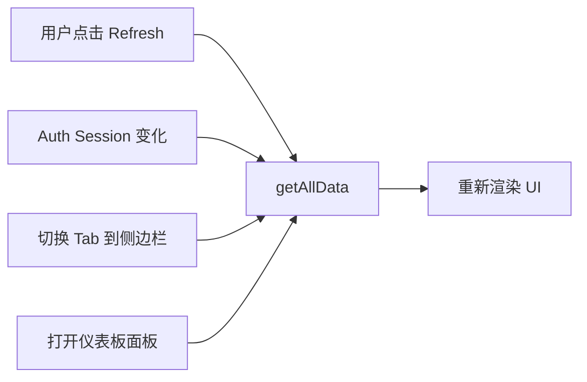

# 数据流图

## 整体数据流

```mermaid
flowchart TD
    subgraph "数据源 Data Sources"
        API[VS Code API<br/>authentication / lm / extensions]
        GDB[全局 state.vscdb<br/>%APPDATA%/Code/User/globalStorage]
        WDB[工作区 state.vscdb<br/>%APPDATA%/Code/User/workspaceStorage/*/]
        FS[文件系统<br/>mcp.json / workspace.json]
        CFG[VS Code 设置<br/>settings.json]
    end

    subgraph "数据获取层 AccountDataFetcher"
        ADF[getAllData]
        ADF --> GHA[getGitHubAccounts]
        ADF --> MSA[getMicrosoftAccounts]
        ADF --> GHE[getGitHubEnterpriseAccounts]
        ADF --> ACD[getActiveCopilotAccount]
        ADF --> ACT[getActiveGitHubAccount]
        ADF --> TE[getAccountTrustedExtensions]
        ADF --> MCP[getAllMcpServers]
        ADF --> COP[getCopilotExtensionInfo]
        ADF --> LM[getLanguageModels]
        ADF --> RT[getRegisteredTools]
        ADF --> AI[getAiStatsFromWorkspaceStorage]
        ADF --> CS[getChatSessionsFromWorkspaceStorage]
        ADF --> WI[getWorkspaceInfo]
        ADF --> CA[getContextAnalysis]
        ADF --> CR[computeReadiness]
    end

    subgraph "UI 层"
        SIDE[SidebarProvider<br/>侧边栏 WebView]
        DASH[DashboardPanel<br/>仪表板 WebView]
        TREND[trendsPanel<br/>趋势标签页]
    end

    API --> GHA
    API --> MSA
    API --> GHE
    API --> LM
    API --> RT
    API --> COP
    API --> WI
    GDB --> ACD
    GDB --> TE
    GDB --> CA
    WDB --> AI
    WDB --> CS
    FS --> MCP
    CFG --> MCP
    CFG --> CA
    CFG --> AI

    ADF -->|完整 data 对象| DASH
    ADF -->|完整 data 对象| SIDE
    DASH --> TREND
```



## 返回的 data 对象结构

```javascript
{
    github:          [{ id, label, provider, hasSession, scopes, accessToken }],
    microsoft:       [{ id, label, provider, hasSession, scopes }],
    githubEnterprise:[{ id, label, provider, hasSession }],
    activeGitHubAccount:    { id, label, detectedVia } | null,
    activeCopilotAccount:   { label, provider, lastUsed, detectedVia } | null,
    trustedExtensions: {
        github:       { "<label>": [{ extensionId, extensionName, scopes, lastUsed }] },
        microsoft:    { "<label>": [...] },
        mcpServers:   [{ extensionId, extensionName, scopes, lastUsed }],
        copilotPolicy: { ... } | null
    },
    mcpServers:      [{ name, type, command, args, configPath, source, gallery }],
    copilot: {
        copilot:     { installed, version, active, extensionId },
        copilotChat: { installed, version, active, extensionId }
    },
    languageModels:  [{ id, name, vendor, family, version, maxInputTokens, maxOutputTokens }],
    registeredTools: [{ name, description, tags, hasSchema }],
    workspace:       { name, folders: [{ name, path }], totalFolders },
    aiStats:         [{ startTime, date, typedCharacters, aiCharacters,
                        acceptedInlineSuggestions, chatEditCount, workspace }],
    aiStatsEnabled:  true | false,
    chatSessions:    [{ sessionId, title, workspace, creationDate, lastMessageDate,
                        messageCount, mode, chatType, agentName, model,
                        initialLocation, source, status, statusLabel,
                        providerType, description, changes, canReopen,
                        isCurrentWorkspace, editSummary, messages }],
    contextAnalysis: [{ modelName, modelId, vendor, family, maxInputTokens,
                        maxOutputTokens, thinkingBudgetTokens, totalAllocation,
                        toolDefinitionsTokens, toolCount, openEditors, segments }],
    readiness:       { status, issues[], hasGithub, hasCopilot, ... },
    timestamp:       "ISO 8601"
}
```

## 刷新触发点


