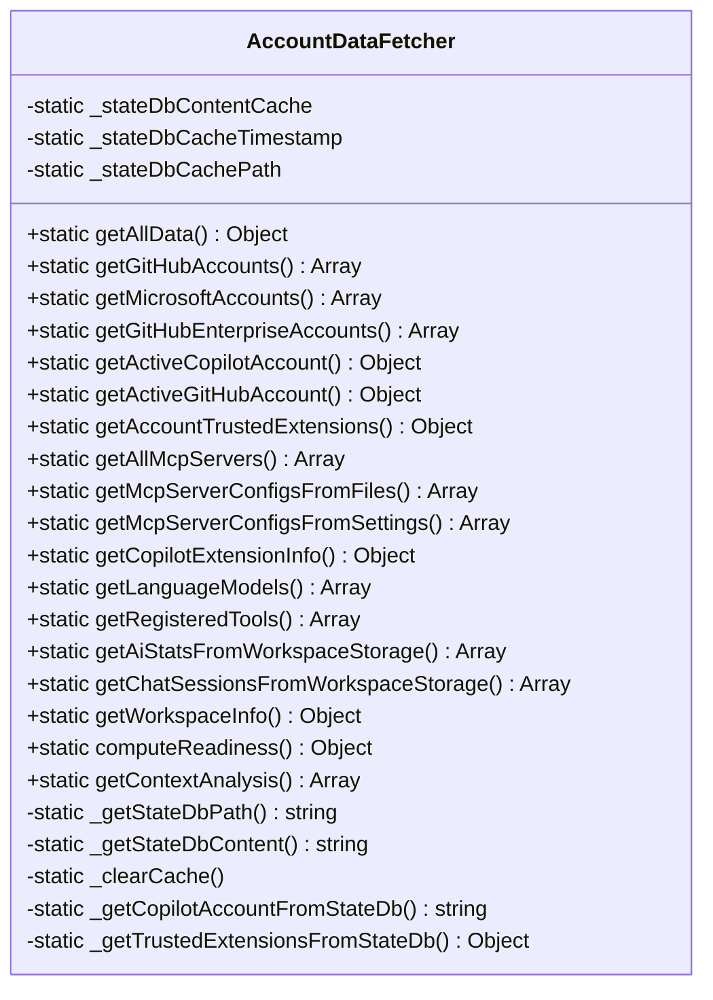
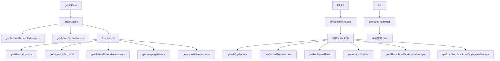
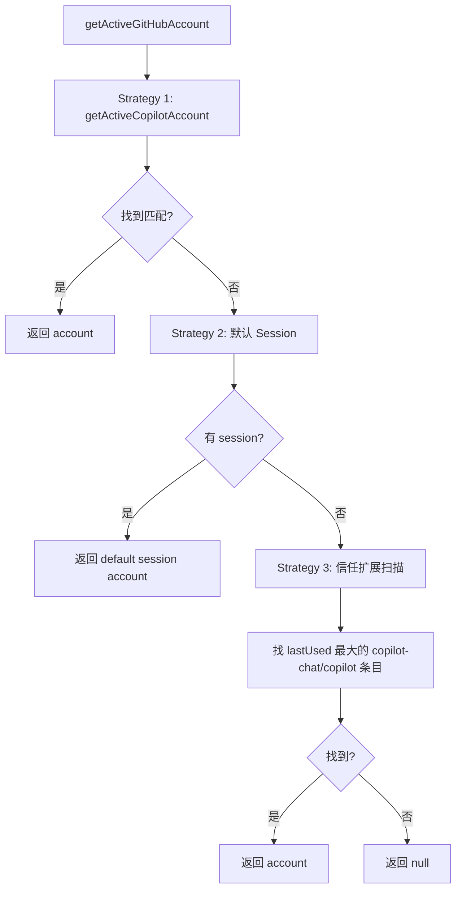

# 数据获取层 — `accountDataFetcher.js`

## 概述

这是整个扩展的**核心模块**，约 1600 行，负责从 VS Code API 和本地 SQLite 数据库中获取所有数据。设计为纯静态类，所有方法都是 `static`。

## 类结构

## getAllData() — 主聚合入口

## 数据来源

### 1. VS Code API（异步、可靠）

| 方法 | API 调用 | 返回数据 |
|------|----------|----------|
| `getGitHubAccounts` | `vscode.authentication.getAccounts('github')` + `getSession()` | 账户 ID、标签、会话状态、Scopes |
| `getMicrosoftAccounts` | `vscode.authentication.getAccounts('microsoft')` + `getSession()` | 同上 |
| `getGitHubEnterpriseAccounts` | `vscode.authentication.getAccounts('github-enterprise')` | 基础账户信息 |
| `getLanguageModels` | `vscode.lm.selectChatModels()` | 模型 ID、厂商、家族、Token 限制 |
| `getRegisteredTools` | `vscode.lm.tools` | 工具名、描述、标签、Schema |
| `getCopilotExtensionInfo` | `vscode.extensions.getExtension()` | 安装状态、版本、活跃状态 |
| `getWorkspaceInfo` | `vscode.workspace.workspaceFolders` | 工作区名称和路径 |

### 2. 本地 SQLite 数据库（文件扫描、脆弱）

扩展直接读取 VS Code 的内部 SQLite 数据库文件（`state.vscdb`），不使用 SQLite 驱动，而是用**二进制字符串扫描 + 正则匹配**的方式提取 JSON 数据。

#### 全局状态库
`%APPDATA%/Code/User/globalStorage/state.vscdb`

| 方法 | 搜索的 Key | 用途 |
|------|-----------|------|
| `_getCopilotAccountFromStateDb` | `github.copilot-github` | 提取 Copilot 授权的 GitHub 账户名 |
| `getAccountTrustedExtensions` | `github-<label>-usages` | 每个账户的信任扩展列表 |
| `getAccountTrustedExtensions` | `microsoft-<label>-usages` | Microsoft 账户信任扩展 |
| `getAccountTrustedExtensions` | `mcpserver-usages` | MCP 服务器信任数据 |
| `getAccountTrustedExtensions` | `defaultAccount.cachedPolicyData` | Copilot 策略数据 |

#### 工作区状态库
`%APPDATA%/Code/User/workspaceStorage/*/state.vscdb`

| 方法 | 搜索内容 | 用途 |
|------|---------|------|
| `getAiStatsFromWorkspaceStorage` | `{"startTime":<ts>,"typedCharacters":...}` | AI 用量统计 |
| `getChatSessionsFromWorkspaceStorage` | `agentSessions.model.cache` | Agent 模式会话 |
| `getChatSessionsFromWorkspaceStorage` | `chatSessions/*.json` / `.jsonl` | 聊天面板会话 |

#### JSONL 解析（新格式）

VS Code 较新版本使用 JSONL 格式存储会话，每条记录是增量 patch：
- `kind=0`: 初始状态（含完整会话元数据）
- `kind=1`: result（用户 prompt 文本）
- `kind=2`: response（AI 回复）/ full requests array snapshot

### 3. 文件系统

| 方法 | 路径 | 用途 |
|------|------|------|
| `getMcpServerConfigsFromFiles` | `.vscode/mcp.json`、`vscode/mcp.json`、`mcp.json`、`~/.vscode/mcp.json` | MCP 服务器配置（支持 JSONC 注释剥离） |

### 4. VS Code 设置

| 方法 | 配置键 | 用途 |
|------|--------|------|
| `getMcpServerConfigsFromSettings` | `mcp.servers` | MCP 服务器配置 |
| `getContextAnalysis` | `github.copilot.chat.anthropic.thinking.budgetTokens` | Thinking Budget |
| `getAllData` | `editor.aiStats.enabled` | AI Stats 启用状态 |

## 活跃账户检测策略

## 状态 DB 缓存机制

由于每次刷新需要多次读取同一个 `state.vscdb`（约 50MB+），实现了**每刷新周期缓存**：

- `_stateDbContentCache`: 缓存的文件内容
- `_stateDbCacheTimestamp`: 缓存时间戳（3 秒有效期）
- 每次 `getAllData()` 开始时调用 `_clearCache()` 清除缓存
